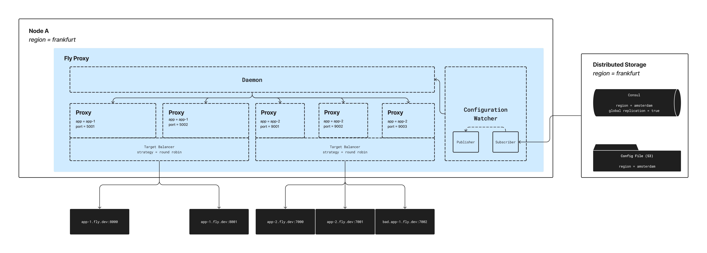
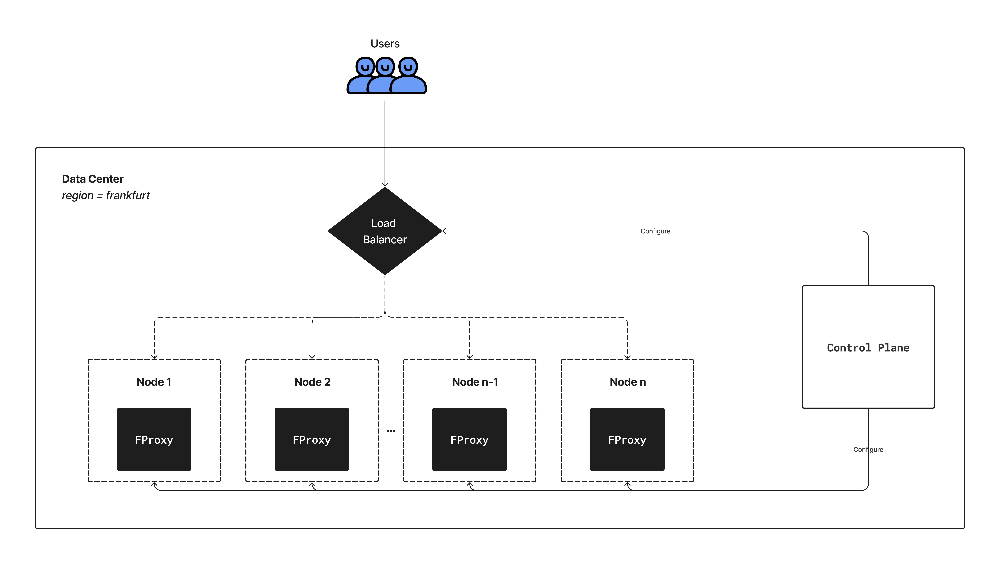

# 🌎 FProxy

Just another stripped-down L4 proxy with a few batteries included.



# 🚀 Running the apps

The codebase comprises two core modules:

- [fproxy](./fproxy/): Houses the proxy implementation, and
- [ftest](./ft/): A dead-simple testing CLI testing tool for the proxy.

### Running `fproxy`

The proxy expects an environment variable `FPROXY_CONFIG_PATH` which is the path to a [configuration file](./config.json) that declaratively states what apps the proxy should start up with. With the path to the config file, you can proceed to run it via:

```sh
FPROXY_CONFIG_PATH=<specify path to config file> cargo run
```

> **NOTE:** Log level can be set via the environment variable `RUST_LOG`. See [here](https://docs.rs/env_logger/0.10.0/env_logger/#enabling-logging) for available options. By default it is configured to `trace`.

### Running `ftest`

From the root of the `ftest` directory, you can see all available commands for the CLI by running:

```sh
go run help
```

The output should be similar to:

```sh
Testing tool for fproxy

Usage:
  ftest [command]

Available Commands:
  balancer    Check if proxy supports load balancing
  completion  Generate the autocompletion script for the specified shell
  help        Help about any command
  ping        Send ping data to proxy (supports IPv4 and IPv6)
  simulate    Simulate requests to proxy

Flags:
  -h, --help   help for ftest

Use "ftest [command] --help" for more information about a command.
```

# ⛳️ Goals

- **Minimize latency:** As much as possible, the time to establish a connection with a target should be minimized. Paying as much cost upfront and caching is fundamental to the design.
- **Reliability:** Routing of requests should be done will little to no disruption, and when configuration changes are made for apps, rolling out such changes to the corresponding proxies should be done without any downtime.
- **Distributed:** Proxy should easily be extended to run within a distributed system with very little modification.
- **Extensibility:** Plugging in new custom components into the proxy should be as straightforward as implementing a trait, and easily registering the plugin into the proxy
- **Configurable:** Make all parts of the system configurable such that we can easily expose all of this configuration to the end user later on either via an API or declarative configuration.

# ❓ FAQs

**What might break under a production load? What needs to happen before your proxy is production ready?**

- At the moment, we are running only one instance of the proxy. For high availability, we must deploy at least 3 instances of each app's proxy across multiple nodes. I'll dive deeper into this in the _how would you make a global, clustered version of your proxy_ section below.
- We also need a process to check for the liveness of each app's proxy running within a single node, and if we notice for some unforeseen reason the proxy has unexpectedly terminated, we should automatically restart only that proxy listener.
- As more apps get deployed within a single node, I anticipate we'll start experiencing longer rollout times of new proxies - especially if multiple app proxies need to be updated at the same time. At the moment, all apps get redeployed whenever there's a configuration change for even a single app. A huge improvement will be to resolve only what apps were affected, and only update them.
- During peak periods for an app, we'll experience cases where a node running a proxy could be nearing its limits in terms of resource usage. To handle this without any downtime, it'll be important to support autoscaling the proxy instance running on that node to multiple nodes (especially the app receiving the most traffic). Adding support for autoscaling specific app's proxy instances across multiple nodes to ensure that we can continue serving requests even as traffic to an app increases without any downtime. A control plane located with each region could help us orchestrate this (more on it while discussing a clustered version of the proxy).

**If this were deployed to production, is there anything you could do with your proxy that would make our customers happy?**

- Support for configuring what load balancing strategy to use for app targets.
  Support for rule-based balancing strategy - basically users should be able to write custom rules for how requests should be balanced.
- Collection of useful metrics, alongside supporting OTEL for easy exports. These metrics could include connection/disconnection attempts, total rollouts, connection time for each request, time to connect, amount of data in/out etc.
  Allow users to define custom availability probes - this should allow them to deploy custom workloads behind our proxy. We can then rely on these availability probes to determine if a newly rolled-out proxy is ready to start accepting requests.
- Streaming logs for proxies for each app to the end user will increase their visibility into how their requests are routed to their apps on the edge.

**If you were starting over, is there anything you’d do differently?**

I'm pretty much comfortable with the existing implementation. There are lots of improvements, but not critical pieces with costly mistakes that would warrant a significant overhaul. For improvements, the most notable one is capturing more traces, identifying where we spend the most time, and working towards improving it since it could have a ripple effect latency-wise across applications served through the proxy.

**How would you make a global, clustered version of your proxy?**
At the moment, the proxy is currently designed to run as a single instance. To make it run within a clustered version, there are a couple of improvements we'll need to make alongside components we'll need to introduce.



Here are lists of possible improvements:

- To ensure our proxies are highly available, we need to ensure at every point we are running at least 3 node instances where our proxy with the same app configuration is running within each region/data center.
- We also need to improve our existing fproxy daemon to check for the liveness of every app's proxy, and in a case where a proxy for some reason crashes, the daemon should automatically restart such proxy. That'll mean we keep the latest configuration of each app we're proxying to since it'll be instrumental in restarting any proxy that happens to crash.
- Introduce either a load balancer or a service mesh in front of all nodes instances running the proxy within each region, and for each IP address within our available IP address blocks should load balance the incoming requests across all the nodes where an app's proxy is running on.
- Introduce a control plane that will be backed by some distributed store, and its primary responsibilities will be to orchestrate the entire process of:

  - **Running proxies across multiple nodes:** Since we can have lots of apps, we'll easily max out the available ports we can bind to within a single node. To have a robust system to handle this, we'll need to have a process for coordinating the even distribution of what nodes each app's proxies will run to ensure high availability, maximizing the available ports within a node, and minimizing the number of nodes we have to run. All of that mappings can be stored within a distributed store. A clustered version of this store should be located within each data center or region for high availability.
  - **Updating routing rules of external load balancers**: The routing rules of the load balancers/mesh placed in front of our proxies should always be updated to reflect the mapping of where each instance of an app's proxy is running on, and the port they're bounded to on each of the nodes (as described above). To ensure there's no downtime, the process of rolling out a new change for the app whenever its configuration changes will span multiple and well-defined sequential legs of operations spanning both the nodes running the proxies and also the load balancer/mesh. A rough idea is:
    - Trigger proxy updates for apps which is currently supported,
    - We'll need to tweak our proxy implementation to expose the readiness status for each app's proxy. This is essential for the control plane to know when it's the right time to update the routing rules on the user-facing load balancers.
    - Once all app's proxies are ready, and new instances of the proxy were deployed, the control plane should update the routing rule of all load balancers to reflect this change so that it can proceed to route load balancer requests across the previous and newly deployed proxy instance.

- Having mechanisms in place auto-scale both nodes and specific app's proxies experiencing increased traffic spikes will be a great addition to further increase reliability and HA. To track the metrics for each proxy, we can deploy a metrics collector as a [sidecar](https://learn.microsoft.com/en-us/azure/architecture/patterns/sidecar) to our proxy instance, and its primary responsibility will be to collect metrics and share these metrics with the control plane. Depending on the status of the metrics, our control plane can then decide to either auto-scale app proxy instances either within the same node or on a new node.

# 🏊 Deep Dive

There are critical components that make up the proxy implementation and they have been described below.

## Configuration Watcher

A configuration watcher is a trait that abstracts away a configuration source for the proxy system, and its goal is to provide support for watching changes in a configuration source. The trait is designed to be flexible, with support for different notification systems, such as file-based watcher notifications and pub/sub systems. Whenever a user makes a change to their app configuration, its sole responsibility is to:

- Validate the configuration values, and
- Broadcast the changes to the daemon process if it's a valid configuration.

```rust
pub trait ConfigSubscriber<C> {
    /// Error that occurs while subscribing for config changes.
    type Error;

    /// Most recent configuration after the change occurs.
    type Config;

    /// Subscribe to changes in a configuration source.
    fn subscribe(&self) -> Result<Subscriber<C, Self::Config>, Self::Error>;
}

/// Handle to subscribe to configuration changes.
pub struct Subscriber<C, T> {
    /// Handle context.
    #[allow(dead_code)]
    context: C,

    /// Receiver for configuration changes.
    rx: UnboundedReceiver<T>,
}
```

### Available Implementations

- **File Watcher:** This is supported out-of-the-box, and expects a path to the proxy configuration. It watches for file updates via the [notify](https://docs.rs/notify/latest/notify) crate. As earlier mentioned, the configuration is validated and if it's valid, we proceed to broadcast a message containing the modified app configuration via channels to the daemon process for proxy orchestration (rollout and tear-down).

### Improvements

- To run our application in a distributed environment, one huge improvement will be to add support for a distributed subscriber/listener watcher, which broadcasts configuration changes in an orderly fashion to all the proxy daemons' running across all multiple nodes. Using an off-the-shelf pub/sub solution like ZeroMQ or RabbitMQ can be a good start, but as our needs evolve we can further explore more solutions that'll fit our needs.

- In addition, instead of sending the entire config changes for all the apps (as is the case when a file changes), the system can identify the diff and send only the changes for the apps that have changed. The changes should be atomic operations which can either be: **delete proxy** when an app/port is deleted from the config or **create proxy** whose configs changed. With this approach, the daemon can efficiently orchestrate the process of shutting down old versions of the proxy and creating new proxy instances without rolling new instances of proxies for _all_ apps.
  
## Strategy

The strategy component is responsible for providing support for different load-balancing strategies over targets specified in the proxy configuration for an app. All available strategies have to implement the `Strategy` trait defined below which is almost similar to the `Iterator` trait.

```rust
pub trait Strategy: Send + Sync {
    type Item;

    /// Get the next item based on a balancing strategy.
    fn next(&self) -> Option<&Self::Item>;
}
```

### Available Implementations

**Round Robin:** This returns the target in an orderly, roundtable and non-blocking fashion whenever `.next()` is called. Under the hood, it makes use of an atomic counter to prevent the case of a blocking operation when called from multiple proxies running on different threads. When the end of the cycle is reached, instead of returning `None`, it proceeds to continue from the beginning of the cycle.

### Improvements

- Supporting multiple strategies and allowing users to specify what strategy to use per app.
- Looking at the worst-case scenario for the round-robin, it is subject to the major pitfall of **always** assigning the same unavailable target to the same proxy whenever `.next()` is called. To improve this, the round-robin strategy can be built over a new type of strategy: **availability strategy**.
  - The sole purpose of the availability strategy is to periodically perform availability checks (e.g. DNS lookups, or any user-defined checks) for all targets of an app and only expose available targets to either our round-robin strategy or any other strategy build over it.
  - The process of checking for availability should be non-blocking, and that can be achieved with the use of 2 buckets (see [draft implementation](https://gist.github.com/tnkemdilim/5c2f2e8f808d29dea75facfa3308ab64)).

## Proxy

The proxy component is a lightweight wrapper around a TCP listener that can be configured via the proxy configuration received from the configuration watcher. Each request to the proxy is handled on a dedicated thread spawned via [tokio](https://tokio.rs).

Comprising of a client whose sole responsibility is to request for a target to establish a connection with from the selected strategy resolver, and then to attempt to establish a connection the connection. Multiple retry attempts are made with new targets returned from our resolver implementation until either a connection is established or a connection timeout has elapsed. For the latter, `RST` is immediately sent back to the client signifying that the connection has been closed.

To achieve no-downtime updates, we bind proxy listeners with `SO_REUSE_ADDR` and `SO_REUSE_PORT` enabled. This allows multiple listeners for the same proxy to run on the same socket address while leveraging the OS's ability to _evenly_ distribute the incoming requests between the multiple proxy TCP listeners. Once the new proxy is up and running to start serving requests, a shutdown signal is sent to the old proxy to gracefully terminate. Any request currently being handled by the old proxy will run to completion except if it exceeds the configured timeout, while new requests will only be routed to the new proxy.

Finally, DNS resolution for targets happens in the proxy, and it is intentional. To minimize the possibility of a proxy running with stale DNS addresses (which could be the case where a proxy hardly ever gets restarted), we perform that check for a target recommended to us by the target resolver. To minimize the impact this could have on latency, and also further improve our DNS resolution time, [trust-dns-resolver]() is utilized over [getaddressinfo]() mainly due to its caching feature.

### Improvements

- Currently, DNS records are cached in memory (LRU). To further improve the overall time to establish a connection, we can switch our DNS resolver storage/caching backend to a database optimized mainly for reads, and ensure the databases are deployed per region.
- Allowing users to configure the properties of each proxy declaratively or via APIs will further allow more flexibility. This could include things like connection timeout, read/write timeouts, etc. You can find the currently supported proxy configuration in [config.rs](./fproxy/src/proxy/config.rs) file.
- Users should be allowed to specify custom rules for liveness and readiness probes tailored for the use case of their apps will further open up the possibility of running more tailored apps.
- Metrics for each of the proxies should be captured via OTEL. This can include (but is not limited to) connection and disconnection attempts, number of rollouts, connection time for each request, time to connect, and amount of data in/out. This opens up the opportunity for users to visualize these metrics across different percentiles and criteria per region.

## Daemon

The daemon runs as a [sidecar](https://learn.microsoft.com/en-us/azure/architecture/patterns/sidecar) that serves the purpose of an orchestrator which listens for changes from a configuration watcher and proceeds to trigger a rollout of proxy for apps that have changed. It rolls out app changes by restarting every app whose config has changed, and for ports that got removed, the previously running app instance is gracefully shut down.

### Improvements

- At the moment, if an app proxy failed during rollout, we have no way of communicating that change to the user. Having a global mechanism in place for streaming logs and changes happening to proxies running on the edge will open up much more visibility to the end users.
- Daemons are currently configured by hardcoding values in the application binary. To reduce the need to constantly deploy new versions of the daemon, we should seek to replace our configuration source with a distributed database, with support for configuring daemons running across multiple nodes within a region.
